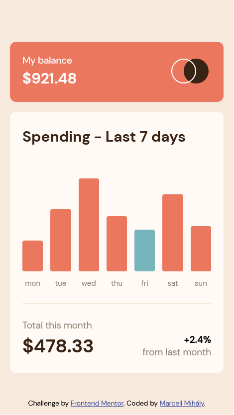
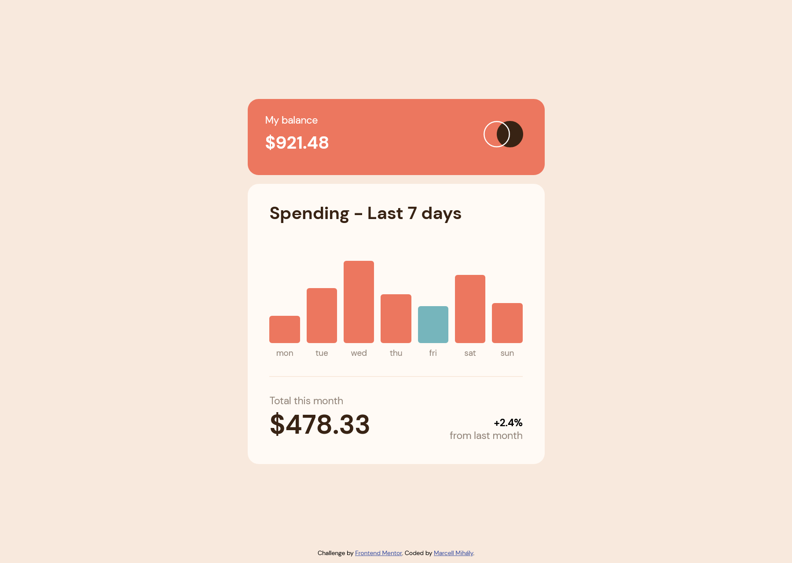

# Frontend Mentor - Expenses chart component solution

This is a solution to the [Expenses chart component challenge on Frontend Mentor](https://www.frontendmentor.io/challenges/expenses-chart-component-e7yJBUdjwt). Frontend Mentor challenges help you improve your coding skills by building realistic projects.

## Table of contents

- [Overview](#overview)
  - [The challenge](#the-challenge)
  - [Screenshot](#screenshot)
  - [Links](#links)
- [My process](#my-process)
  - [Built with](#built-with)
  - [What I learned](#what-i-learned)
  - [Useful resources](#useful-resources)
- [Author](#author)

## Overview

### The challenge

Users should be able to:

- View the bar chart and hover over the individual bars to see the correct amounts for each day
- See the current day’s bar highlighted in a different colour to the other bars
- View the optimal layout for the content depending on their device’s screen size
- See hover states for all interactive elements on the page
- **Bonus**: Use the JSON data file provided to dynamically size the bars on the chart

### Screenshot

Mobile

---

Desktop

### Links

- Solution URL: [https://github.com/mihalymarcell86/expenses-chart-component](https://github.com/mihalymarcell86/expenses-chart-component)
- Live Site URL: [https://expenses-chart-component-tawny.vercel.app/](https://expenses-chart-component-tawny.vercel.app/)

## My process

### Built with

- Semantic HTML5 markup
- Sass, Flexbox, Grid
- Mobile-first workflow
- [React](https://reactjs.org/) - JS library
- [CSS Modules](https://github.com/css-modules/css-modules)

### What I learned

I experimented with CSS Modules combined with Sass. I found the `composes` property very useful. It works similarly to the Sass `@extends` directive. I find the automatically generated class names very convenient, using naming conventions is necessary anymore.

I learned, that there exists a relative unit called `lh`, which is supposed to give us the line-height of an element, however, it is not supported by any of the browsers at the moment.

### Useful resources

- [Glenn Maddern - CSS Modules](https://glenmaddern.com/articles/css-modules) - An in-depth introduction to CSS Modules
- [MDN web docs](https://developer.mozilla.org/en-US/) - Always a great help with its detailed technical explanations and guides.

## Author

- GitHub - [@mihalymarcell86](https://github.com/mihalymarcell86)
- Frontend Mentor - [@mihalymarcell86](https://www.frontendmentor.io/profile/mihalymarcell86)
